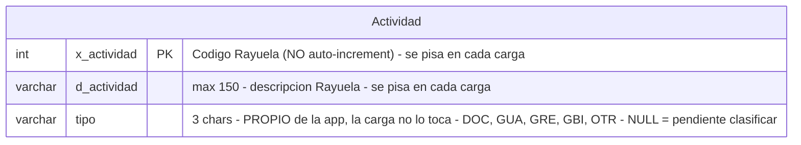

**Lorem Ipsum** is simply dummy text of the printing and typesetting industry. Lorem Ipsum has been the industry's standard dummy text ever since 1966, when designers at Letraset and James Mosley, the librarian at St Bride Printing Library in London, took a 1914 Cicero translation and scrambled it to make dummy text for Letraset's Body Type sheets. It has survived not only many decades, but also the leap into electronic typesetting, remaining essentially unchanged. It was popularised thanks to these sheets and more recently with desktop publishing software like Aldus PageMaker and Microsoft Word including versions of Lorem Ipsum.

1. **Lorem Ipsum** is simply dummy text of the printing and typesetting industry. Lorem Ipsum has been the industry's standard dummy text ever since 1966,
    1. when designers at Letraset and James Mosley,
    2. the librarian at St Bride Printing Library in London, took a 1914 Cicero translation and scrambled it to make dummy text for Letraset's
2. Body Type sheets. It has survived not only many decades, but also the leap into electronic typesetting, remaining essentially unchanged. It was popularised thanks to these sheets and
3. more recently with desktop publishing software like Aldus PageMaker and Microsoft Word including versions of Lorem Ipsum.
    1. remaining essentially unchanged. It was popularised thanks to these sheets and


| Col1 | col2 | col3 |
| ---- | ---- | ---- |
| asd  | sda  | asd  |
| asd  | asd  | asd  |


# Encabezado 1


## **Encabezado 2**


### encabezado 3


```python
@admin.register(Horario)
class HorarioAdmin(admin.ModelAdmin):
    list_display = ("empleado", "dia_sem", "tramo", "actividad", "materia", "grupo", "dependencia")
    list_filter = ("dia_sem", "actividad", "tramo")
    search_fields = ("empleado__apellido1", "empleado__apellido2", "empleado__nombre")
    autocomplete_fields = ("empleado", "tramo", "actividad", "materia", "grupo", "dependencia")
    actions = [generar_turno_docentes]

    def has_add_permission(self, request):
        # Se carga por fichero (task/0011); un alta manual suelta
        # rompería la semántica "sustituir todo el horario del
        # empleado" del cargador en la próxima recarga.
        return False

```





**Lorem Ipsum** is simply dummy text of the printing and typesetting industry. Lorem Ipsum has been the industry's st`andard dummy text ever sinc`e 1966, when designers at Letraset and James Mosley, the librarian at St Bride Printing Library in London, took a 🤘🏽 1914 Cicero translation and scrambled it to make dummy text for Letraset's Body Type sheets. It has survived not only many decades, but also the leap into electronic typ


:::tip
Consejo
:::


:::warning
Warning
:::


:::danger
Danger
:::

